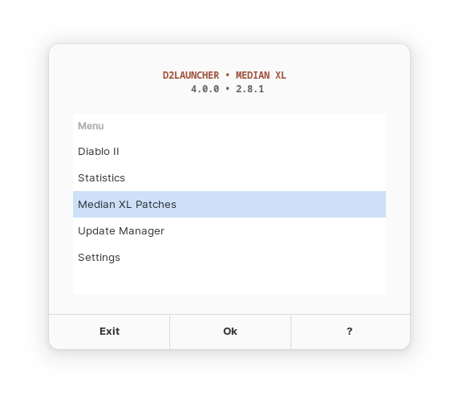

<div align="center">
  <div><h1>Diablo II • Median XL • Launcher</h1></div>
  <div></div>
  <div><a href="https://github.com/murkl/d2launcher/releases/latest"><b>Download</b></a></div>
  <div></div>
  <div><p></p></div>
</div>

# Features

- Simple Backup & Restore (Savegames & Diablo II Installation)
- User Tweaks (Auto Install Scripts for Plugins etc.)
- Custom Proton (64 Bit) build will download by script
- Download latest Median XL patch (incl. notification on new updates)
- Median XL Version Management
- Import/Export of savegames
- [D2 Stats](https://github.com/Zahariel1942/D2Stats/) included (will download by script)
- [Sven's Glide wrapper](http://www.svenswrapper.de) included
- Direct Draw [cnc-ddraw](https://github.com/FunkyFr3sh/cnc-ddraw) supported
- Diablo II 1.13c files to work with Median XL included
- Updater (incl. notification on new updates)
- Supports the execution of EXE files within the wine prefix
- Configurable (see [Documentation](#documentation))
- Shellcheck approved
- 100% GUI

# Installation

You need the Diablo II installation files for the script to work! (You will be asked for the location in the script)

## Arch Linux

- Install from AUR
  - [aur/d2launcher](https://aur.archlinux.org/packages/d2launcher)

## Debian/Ubuntu/elementaryOS

- Download & Extract: <a href="https://github.com/murkl/d2launcher/releases/latest"><b>d2launcher.tar.gz</b></a>
- Install Dependencies
  - `sudo apt install wine zenity curl unzip jq wmctrl fuse2 xdelta3`
  - Some distros label fuse2 as libfuse2, if you receive an error about fuse2 not being found, try libfuse2
- Run
  - `./d2launcher`

## Pop_OS!

- Download & Extract: <a href="https://github.com/murkl/d2launcher/releases/latest"><b>d2launcher.tar.gz</b></a>
- Install Dependencies
  - `sudo apt install wine zenity curl unzip jq wmctrl fuse2 ruby-notify xdelta3`
  - Some distros label fuse2 as libfuse2, if you receive an error about fuse2 not being found, try libfuse2
- Run
  - `./d2launcher`

# Documentation

You can override the script properties in the configuration settings (`Settings` > `Edit Configuration`). These settings can be edited manually in `~/.d2launcher/d2launcher.conf`.

## Backup & Restore

All files are located here: `~/.d2launcher`. Simply copy & paste to another system. Feel free to move your Diablo II installation dir to `~/.d2launcher/bin/diablo2` to backup all files together.

## Logging

The logging file is `~/.d2launcher/d2launcher.log` and **is** rotated on every start of d2launcher. This contains only logs from execution of Diablo II.

## Exclude files from update patch

Add this array property to exclude files from update
`mxl_update_exclude=("file1" "file2")`

## Example `d2launcher.conf`

```
d2_dir="$HOME/.d2launcher/bin/diablo2"
d2_exe="Diablo II.exe"
d2_args="-ddraw"
wine_init="gamemoderun"
d2_stats_tray="true"
update_check="true"
mxl_update_check="true"
mxl_update_channel="public"
mxl_update_exclude=("cnc-ddraw config.exe" "ddraw.dll")
gui_width="420"
gui_height="320"
tweaks_url="https://my/custom/tweaks/url/to/d2launcher.tweaks"
```

## Median XL Beta

Change the property `mxl_update_channel` from `public` to `beta`.

## Change Download URL's

```
wine_native_url="https://github.com/Kron4ek/Wine-Builds/releases/download/6.3-7-proton/wine-6.3-7-proton-amd64.tar.xz"
d2_stats_url="https://github.com/Zahariel1942/D2Stats/releases/latest/download/D2Stats.zip"
d2_sigma_loader_url="https://github.com/SyndromeDayna/diablo-2-median-xl-sigma-loader/releases/download/3/sigma-loader.exe"
tweaks_url="https://raw.githubusercontent.com/murkl/d2launcher/refs/heads/main/res/d2launcher.tweaks"
```

**Note:** If you change the URLs, you have to force the regarding update/install: `Update Manger` > `Force Proton Update`/`Force D2Stats Update`

## Custom Wine Version

If you use Wine you have to set `wine_user="$USER"` otherwise for Proton set to `wine_user="steamuser"`

```
wine_default="/path/to/your/custom/wine"
wineprefix="$HOME/my/custom/wine_prefix"
wine_user="steamuser"
```

## Theming

```
gui_width="360"
gui_height="280"
gui_font="UbuntuMono Nerd Font"
gui_color="#eeeeee"
gui_size="9"
gui_dialog_width="280"
gui_dialog_height="140"
gui_dialog_font="UbuntuMono Nerd Font"
gui_dialog_color="#aaaaaa"
gui_dialog_size="9"
```

## Using D2Stats

It's nessesary to start D2Stats (Statistics) in d2launcher first, before starting Diablo II. Because d2launcher will check every start of Diablo II (using pgrep) if D2Stats is running. In this case, d2launcher starts Diablo II automatically with [sigma-loader](https://github.com/SyndromeDayna/diablo-2-median-xl-sigma-loader).

## Using cnc-ddraw

Thanks to [@GnomeBeans](https://github.com/murkl/d2launcher/issues/8#issuecomment-1553762919)

1. Download latest [cnc-ddraw.zip](https://github.com/FunkyFr3sh/cnc-ddraw/releases)
2. Unzip the downloaded `cnc-ddraw.zip` and drop the content into `diablo 2` install dir (same as your `d2_dir` property).
3. Goto `Settings` > `Wine Settings` > `Library` and override/add `ddraw` (set DLL load strategy to: `native then built in`).
4. Change `d2_args` property in `Settings` > `Edit Configuration` from `-3dfx` to `-ddraw`
5. Optimize prefered settings: `Settings` > `Direct Draw Settings` (optional)
6. Run `Diablo II`

## Using Game Mode / Hybrid Graphics

Install the `gamemode` package in your system and add this property in `Settings` > `Edit Configuration`:

```
wine_init="gamemoderun"
```

When using **Hybrid Graphics**, you can add for NVIDIA:

```
wine_init="prime-run gamemoderun"
```

## Diablo II arguments

Goto `Settings` > `Edit Configuration` and modify `d2_args` property:

```
Enable Glide wrapper       | -3dfx
Enable Direct Draw         | -ddraw
Window mode                | -w
Skip to Median XL Login    | -skiptobnet
No sound                   | -ns
```

**Note:** Add multiple arguments with `-ddraw -skiptobnet ...`

## Tweaks

Open `Tweaks` in the main menu and select the desired tweak script that you want to install.

### Update Tweaks Database

To update this shown tweak list, goto `Update Manager` > `Update Tweaks Database`. The file set in the `tweaks_url` property will be downloaded to `~/.d2launcher/d2launcher.tweaks` (or copied if `tweaks_url` is set to a local file).

### Share your own Tweaks

You only need to share your webserver URL and set as `tweaks_url` in settings. Remember to update the tweaks database to create new local `~/.d2launcher/d2lanauncher.tweaks` from `tweaks_url`.

### Example Tweak Database Syntax

Separated by the two header lines `###!> name: ...` and `###!> version ...` (please keep this order), all tweak scripts are saved in one file.

You already have access to variables from `d2launcher.conf`.

**Note: Root access is not supported!**

```
###!> name: my_first_tweak_script
###!> version: 1.0.0

#!/bin/bash
echo "Install my_first_tweak_script"
echo "Diablo II Directory: $d2_dir"
echo "Here I can use my bash code to pimp my Diablo II"
echo "..."

###!> name: my_second_tweak_script
###!> version: latest

#!/bin/bash
echo "Install my_second_tweak_script"
echo "Another plugin"
echo "..."
```

## Glide Wrapper Settings

Change in `Settings` > `Glide Wrapper Settings` (optional)

### Settings

```
☐          window mode
☑          capture mouse
☐          keep aspect ratio
☐          vertical synchronization (VSYNC)
no         fps-limit
no         static size
☐          window extras
auto       refreshrate
☑          desktopresolution
```

### Renderer

```
32 MB       texture-memory
1024x1024   buffer-texture-size
☑           32 bit rendering
☑           texture for videos
☑           bilinear filtering
☑           supersampling
☑           shader-gamma
☐           no gamma
☑           keep desktop composition
```

### Extensions

```
☑           GL_EXT_vertex_array
☑           GL_ATI_fragment_shader
☑           GL_ARB_fragment_program
☑           GL_EXT_paletted_texture
☑           GL_EXT_shared_texture_palette
☑           GL_EXT_packed_pixels
☑           GL_EXT_texture_env_combine
☑           WGL_EXT_swap_control
☑           WGL_ARB_render_texture
```

# External Sources

Many thanks to these projects:

- https://median-xl.com
- https://github.com/Kron4ek/Wine-Builds/
- https://github.com/Kyromyr/D2Stats
- https://github.com/Zahariel1942/D2Stats/
- https://github.com/SyndromeDayna/diablo-2-median-xl-sigma-loader
- https://github.com/synthagency/icons-flat-osx
- http://www.svenswrapper.de
- https://github.com/FunkyFr3sh/cnc-ddraw
- https://github.com/GavinK88/d2gl-mxl-1.0
